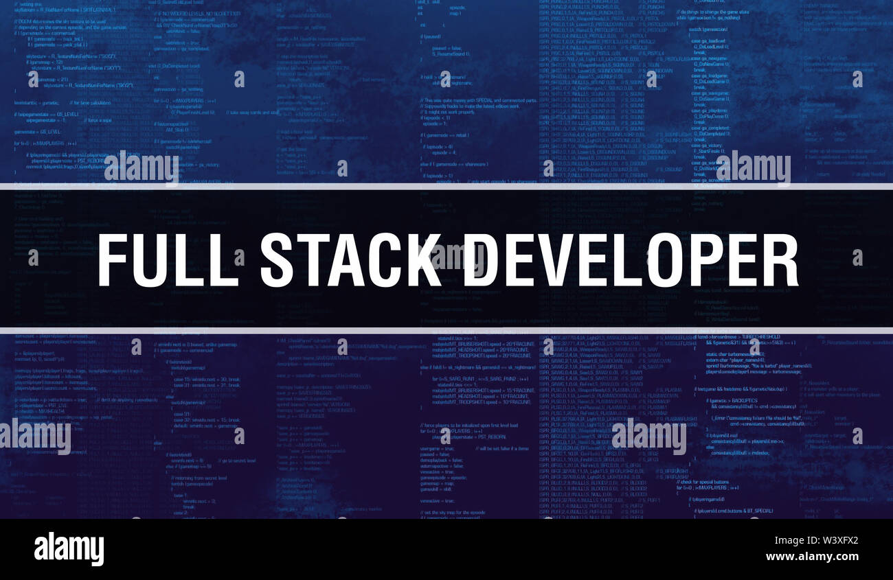

### Hi there 👋

<h1 align="center">Hey Everyone 👋, I'm Satya Priya Ambati</h1>

  

<h3 align="center">Full-Stack Developer</h3>

<!--
**SatyaPriyaAmbati/SatyaPriyaAmbati** is a ✨ _special_ ✨ repository because its `README.md` (this file) appears on your GitHub profile.

Here are some ideas to get you started:

- 🔭 I’m currently working on ...
- 🌱 I’m currently learning ...
- 👯 I’m looking to collaborate on ...
- 🤔 I’m looking for help with ...
- 💬 Ask me about ...
- 📫 How to reach me: ...
- 😄 Pronouns: ...
- ⚡ Fun fact: ...
-->
